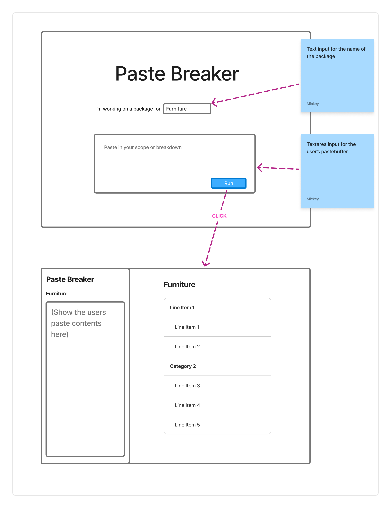

# Full Stack Engineer Tech Challenge Task

## Pre-requisites

- Node.js v22.12.0 or later, we'd recommend using [nvm](https://github.com/nvm-sh/nvm) and then doing `nvm use` in the
  root

## Installation

In the root...

```bash
nvm use
npm install

# Run the backend
cd backend
# Copy the .env.dist file
cp .env.dist .env

# TODO: Fill in any missing environment variables

# Run the backend server
npm run start:dev


# In a separate terminal, run the frontend
cd frontend
# You need to use the right version of node here too
nvm use
npm run start:dev

# You should now be able to navigate to http://localhost:3000
```

## General Architecture

The setup in this repo is such that you run the NestJS server on port 3000 and the React app on port 4010.

The NestJS server is configured to proxy all requests that don't start with `/api` to the React app, so that the React
app can handle the UI whilst the backend handles the API endpoints.

From a local development perspective, it works quite simply.

## Task



Your task is to build something like the above fingerpainting - a tool that let's users paste some text from a budget
or scope and then have AI format it into a breakdown in an opinionated structure (categories and line items).

You are already provided a backend controller [PasteController](../backend/src/breakdown/controller/paste.controller.ts)
which accepts the paste buffer and returns a breakdown of categories and line items. It works with and without the
OpenAI keys - if the API keys are missing, it'll just return some dummy data. Feel free to update the dummy data to be
more interesting/exhaustive.

### Backend changes

The existing endpoint accepts the paste buffer in the request body, but you'll need to update the endpoint to accept the
package name too. The paste buffer makes it's way to the "runnable" which is where it interfaces with the OpenAI models.
Have a crack at including the package name in human message that is given to the model.

### Frontend

This is unsurprisingly where the bulk of the work is! We want you to implement a UI like the one shown above, but you
have creative control to make changes as you see fit.

The core UX is that the user can enter their package name and copy-paste the text from the budget/scope. Then, once 
it's finished running, the user should be presented with the extracted "breakdown".

No need to reinvent the wheel, use [shadcn/ui](https://ui.shadcn.com/) for the UI components. We've already done most of
[the setup](https://ui.shadcn.com/docs/installation/vite) of shadcn, and you add the necessary components as you need.

Things that would be great to see:

- Setup Vitest and write some tests
- Setup Storybook and write some stories

## Example

Below is an example of some text that might be copy-pasted for a "Furniture Supply & Install" package.

```text
FURNITURE SUPPLY & INSTALL		
GENERAL		
Preliminaries	1	Item
Delivery	1	Item
Installation	1	Item
		
		
Foyer/Shopfront		
No furniture required		note
		
FIRST FLOOR - New		
Artwork	3	no
Mirror Consult Rooms	2	no
Desk/Storage Under Mirror	1	no
Office Visitor Chairs	8	no
Office Task Chair	3	no
Procedure Task Chair	1	no
Artwork Pink Ballon	1	no
Artwork The Cabana	1	no
Artwork Poolside PC	1	no
Artwork Pool Party	1	no
Art Hooks	34	no
		
SECOND FLOOR - New		
Artwork	5	no
Office Desks 1800w	12	no
Office Task Chair	12	no
Office Visitor Chairs	8	no
		
TOTAL Furniture Supply & Install		
```

## Time limit

This task is completed async so there's no real way for us to enforce a time limit. We suggest limiting yourself to 1-2
hours as a reference point.

## Git Hygiene

When undertaking this challenge, we ask that you **please do not fork this repository**. Instead, create
a [private repository from this template](https://docs.github.com/en/repositories/creating-and-managing-repositories/creating-a-repository-from-a-template)

If you can, please work from a branch within your private repository, then create a pull request against main when you
are finished - this will make it easier for us to review.

Additionally once you're finished, invite [@tomtomau](https://github.com/tomtomau) to the repository so he can review
code before the next call.

## Questions

If you have any questions or run into any major issues, reach back out to Tom.
